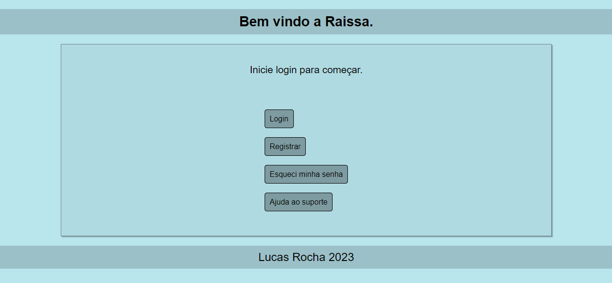
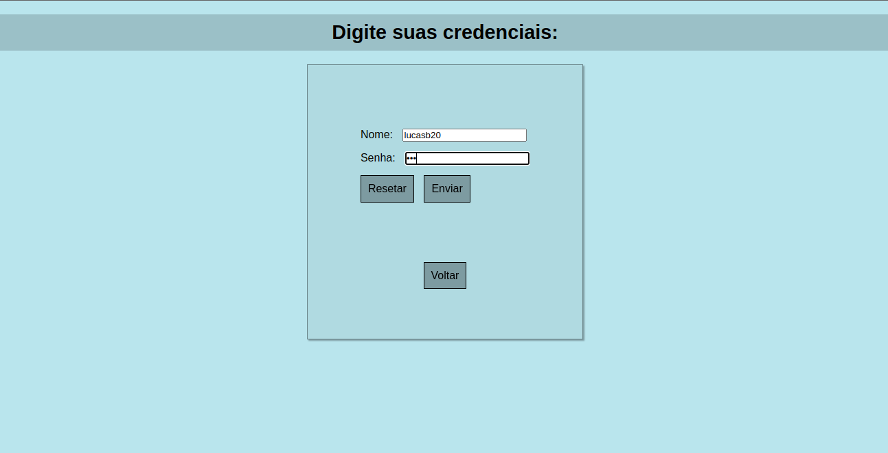
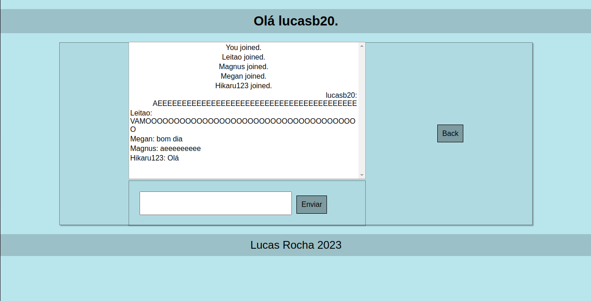

# Raissa
Um aplicativo de rede social feito em Nodejs.

* É um aplicativo que abre um site e você loga com uma conta local, entrando em um chat aberto. Por enquanto, você consegue apenas se registrar, se logar e entrar no chat público com outros usuários que conseguiram logar. Em breve espero poder adicionar mais possibilidades.

* O nome do aplicativo é Raissa porque é um nome que eu acho bonito. Algo semelhante a linguagem Julia, que não foi escolhido em homenagem a alguma desenvolvedora da linguagem, simplesmente acharam um bom nome para se usar.

* É um tipo de projeto que eu faço para treinar programação web, mas esse em específico talvez eu vá fazer várias melhorias ao longo do tempo porque é uma ideia interessante.

* O aplicativo está feito em Expressjs, Mongoose, Socket.io e Middlewares bem conhecidos.

* Instruções para instalação:
  -  Obviamente para usar de um projeto de Javascript precisará do NPM e Node instalados.

  -  Precisará de algum Banco de Dados de Mongodb para poder inicializar o servidor, que por enquanto só é utilizado para armazenar logins.

  -  Eu criei um arquivo keys.js que exporta um objeto com vários dados importantes. Mas eu fiz para não ter o trabalho de ficar retirando toda vez que fosse dar um commit, então não faz muita diferença, você poderá apenas substituir no código.

  -  Por fim, instale todas as dependências (comando: npm install) e acesse no navegador a porta que o servidor está ouvindo.

* Algumas screenshots:
    - Tela Inicial
    

    - Tela de login
    

    - Conversa no chat
    

* Créditos:
    - favicon -> Programador icon by Icons8 - https://icons8.com/

* Ideias a se considerar:
    - Talvez trocar esse nome, né?
    - Criar uma possibilidade de chat privado com um usuário.
    - Criar um sistema de contatos.
    - Criar um sistema de armazenamento de mensagens.
    - Melhorar a programação do chat. Tem alguns problemas como quando há mensagens demais, cria um Scroll, e você tem que rolar para ver as mensagens anteriores, além do visual em si estar meio estranho.
    - Se for contar segurança, esse projeto tem que ser banido né. Mas quem sabe ajustar algumas coisas para os logins, já que é possível ter usuários repetidos, e há algumas gambiarras no projeto.
