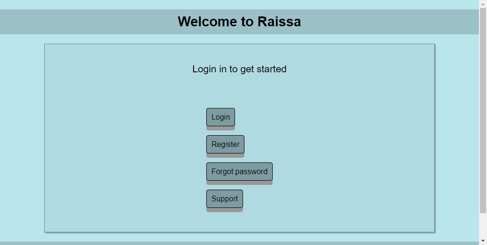
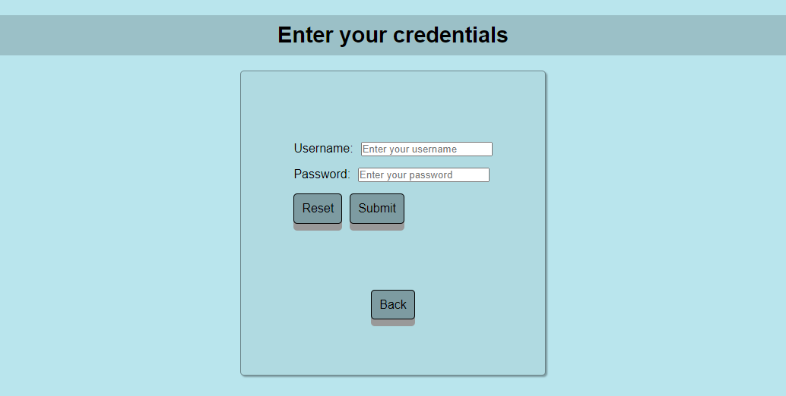
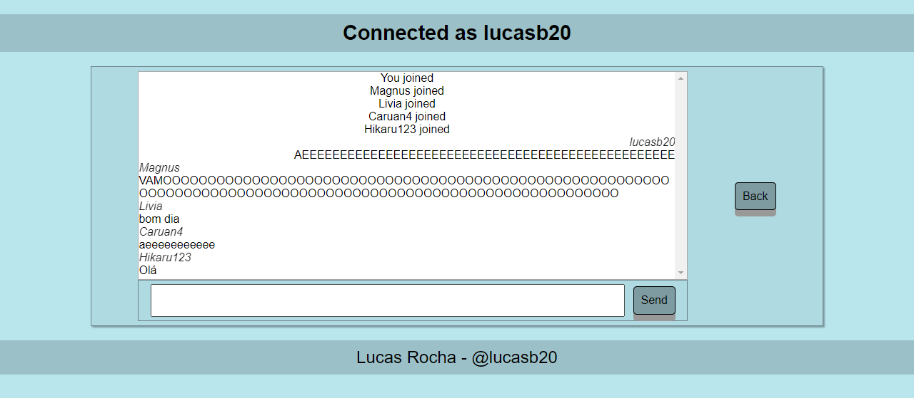

# chat-app
A chat application in Nextjs, Django and Nodejs.

**Description**

It is an application where you can authenticate and log in to enter a public chat.

**System requirements**

* Python
* Node.js
* NPM
* PostgreSQL

**Frontend application installation**

1. Enter the frontend application folder
2. Run `npm install` to install dependencies
3. Run `npm run dev` to launch the application in development mode

**WebSocket server installation**

1. Enter the websocket-server application folder
2. Run `npm install` to install dependencies
3. Run `npm run dev` to launch the application in development mode

**Backend application installation**

1. Enter the backend application folder
2. Run `pip install -r requirements` command to install dependencies
3. Create a database in PostgreSQL
4. Create a .env file with the following format:
```
NAME_DB=name
USER_DB=user
PASSWORD_DB=password
HOST_DB=localhost
PORT_DB=5432
```
5. Run `python manage.py migrate` to apply migrations to the database
6. Run `python manage.py runserver` to run development mode

**Docker Compose**

If you have Docker installed, you can also run the project using Docker Compose.

1. Navigate to the project directory where the `docker-compose.yml` file is located

2. Run `docker-compose up --build` command to build and start the containers

**Screenshots**

Home Page


Login Page


Chat Page

