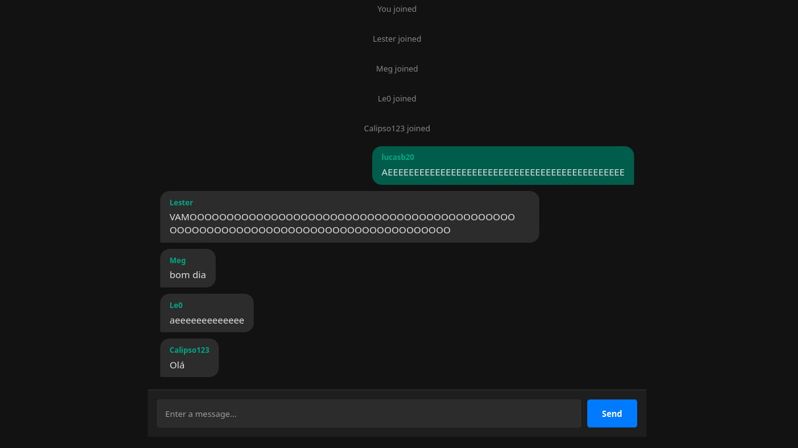

# chat-app

A Node.js application for joining a public chat.

## System Requirements

* Node.js 24.x.x
* npm 11.x.x

## Installation

1. Enter the application folder

2. Run `npm install` to install dependencies

3. Run `npm run dev` to launch the application in development mode

## Docker

If you have Docker installed, you can also run the project using it.

1. Enter the application folder

2. Run `docker build -t chatapp .` command to build the image

3. Run `docker run -p 8080:8080 chatapp` to start the container

## Contributing

Whether you want to share ideas, report bugs, or implement new features, your contribution is welcome! Create a fork, make commits, and submit a pull request.

## License

This project is licensed under the [MIT](LICENSE).
