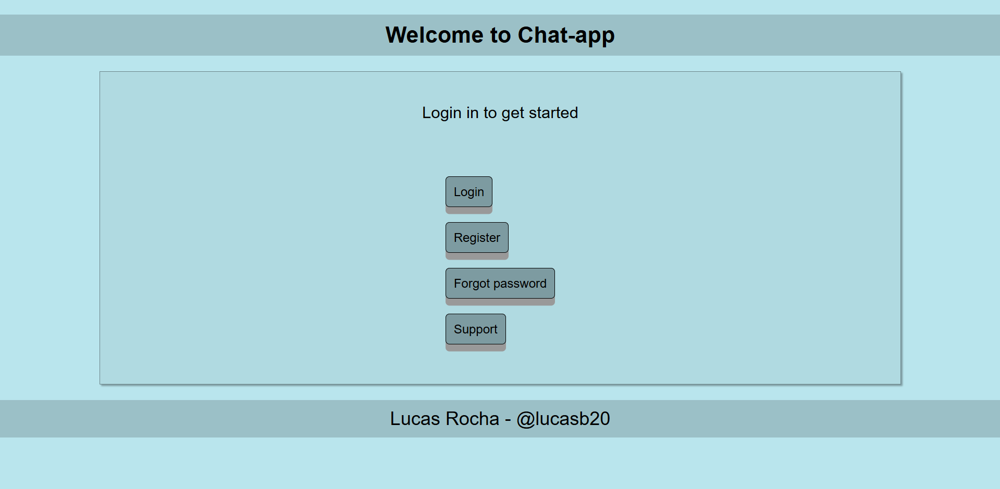
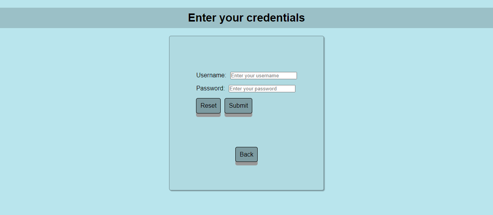

# Raissa
A chat application in Nextjs, Django and Nodejs.

**Description**

It is an application where you can authenticate and log in to enter a public chat.

The name of the application is Raissa because I find this name beautiful. Similar to what happened with the Julia language, which was not chosen to honor a developer, they simply found it a good name to use.

**System requirements**

* Python
* Node.js
* NPM
* PostgreSQL

**Frontend application installation**

1. Enter the frontend application folder
2. Run `npm install` to install dependencies
3. Run `npm run dev` to launch the application in development mode

**WebSocket server installation**

1. Enter the websocket-server application folder
2. Run `npm install` to install dependencies
3. Run `npm run dev` to launch the application in development mode

**API installation**

1. Enter the backend application folder
2. Run `pip install -r requirements` command to install dependencies
3. Create a database in PostgreSQL
4. Create a .env file with the following format:
```
NAME_DB=name
USER_DB=user
PASSWORD_DB=password
HOST_DB=localhost
PORT_DB=5432
```
5. Run `python manage.py migrate` to apply migrations to the database
6. Run `python manage.py runserver` to run development mode


**Docker Compose**

If you have Docker installed, you can also run the project using Docker Compose.

1. Navigate to the project directory where the `docker-compose.yml` file is located

2. Run `docker-compose up --build` command to build and start the containers

**Scripts**

The custom scripts provided within this project were primarily developed to streamline the development process.

These scripts may not be compatible with all systems and configurations, and they may encounter errors related to permissions, shell variations, or missing dependencies. Additionally, they may not handle cases where users do not have all necessary services installed.

I do not recommend using any of these scripts.

**Screenshots**

Home Page


Login Page


Chat Page
